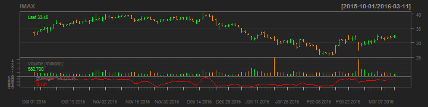
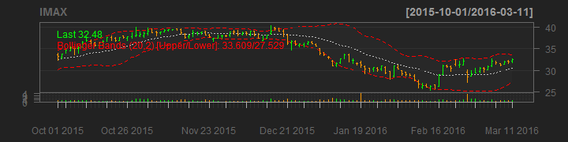

## Developing Data Products Project

A real time APP providing data visualization of financial assets considered good financial investment instruments for 2016, this is according to my research in the stock market, based on Forbes reports.

The Application features a user interface, which allows the user to customize and obtain:
### Inputs: Asset's attributes

```r
### The financial asset name and its symbol. 
### The period of the analysis. Start and end dates. 
### Bollinger Bands. Two choices, Bollinger bands or percet. 
```
### Output: Iteractive Plot

```r
# Historical stock data. Plot depicting an asset trend, which is the general direction 
# of a market price of an asset.
# Bollinger Band Analysis - A Bollinger Band is a band plotted two standard 
#deviations away from a simple moving average.  
```

--- .class #id 

## The APP user interactive interface
#### Selection up to 6 instruments
```r
Imax (IMAX)    | Arista Networks (ANET)
Google (GOOG)  | National Oilwell Varco (NOV)
Netflix (NFLX) | Yahoo (YHOO)  
```
#### Data Range
```r
Start Date   | End Date
```
#### Plot line 
```r
candlesticks | matchsticks
bars         | line
```
### Bollinger Bands
```r
percentage   | bands
```

--- .class #id 


## Analysis of Target asset
### 'Bars-Plot' - IMAX over 6 months with Bollinger Analysis 
#### i - IMAX with 'percent' analysis

```r
chartSeries(IMAX,type = "bars",  subset='last 6 months',TA=c(addVo(),addBBands(n = 20, sd = 2, ma= "SMA", draw = "percent", on = -1)))
```



#### ii - IMAX with 'bands' analysis

```r
 chartSeries(IMAX,type = "bars",  subset='last 6 months',TA=c(addVo(),addBBands(n = 20, sd = 2, ma= "SMA", draw = "bands", on = -1)))
```



--- .class #id 
## Summary
The interactive APP is [here] (https://abblo.shinyapps.io/MyPortfolio/)

The APP code is [here] (https://github.com/ablopez/Coursera-Developing-Data-Products/tree/master/Part%201)

The slidy index.RMD is [here]()

### References:
[Working with xts and quantmode]
(http://www.rinfinance.com/RinFinance2009/presentations/xts_quantmod_workshop.pdf)

[Stock Analisys using R]
(http://www.r-chart.com/2010/06/stock-analysis-using-r.html)

[Bollinger Bands]
(http://www.investopedia.com/terms/b/bollingerbands.asp)
### Conclusion
The APP created can be used as an evaluation of a particular trading instrument. The APP was fully implemented using RStudio with the Shiny package, this file was built using Slidify. The APP attempts to determine the future activity of an instrument, sector or market, using a Technical analysis which focused on the study of past market action to predict future price movements, assisted by Bollinger tools.


